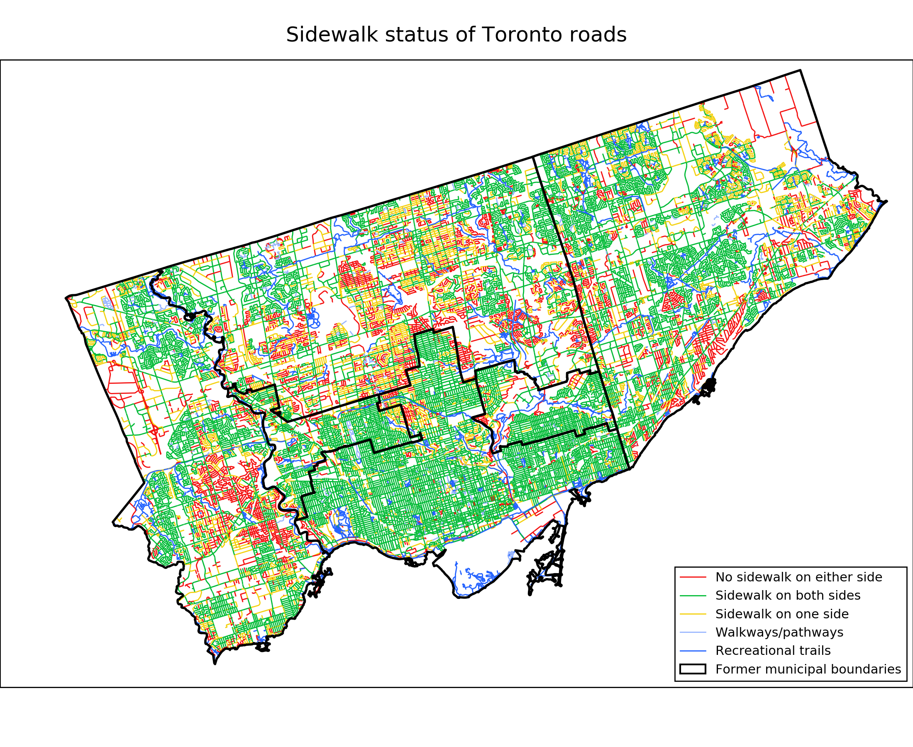

This repo houses my analysis work for the [Open Toronto open data book club meetup](https://www.meetup.com/opentoronto/).  All analysis was done in Jupyter notebooks, and a list of package requirements can be found in the repo README.md.  The full analysis of each dataset can be viewed in the subfolders of the repo.  GitHub's ipynb viewer doesn't seem to allow interactive plots to function, so please use the [nbviewer](https://nbviewer.jupyter.org/) links to each project below.

You'll find short abstracts on all projects, listed in reverse chronological order, as well as a pretty plot generated during each project.

<h1>20/4/2017 - Toronto City Sidewalk Inventory</h1>

The [Toronto Sidewalk Inventory](http://www1.toronto.ca/wps/portal/contentonly?vgnextoid=3cdcfb292f426410VgnVCM10000071d60f89RCRD&vgnextchannel=1a66e03bb8d1e310VgnVCM10000071d60f89RCRD) is a geospatial dataset that gives the availability of sidewalks along Toronto's transportation corridors.  I plot a map of these sidewalks, and investigate the correlation between lack of sidewalks along the roads of a neighbourhood with its population density and median household income.

    

 
<i>Plot of sidewalk availability status for the roadways of Toronto, with the old Toronto municipality boundaries overplotted for reference.  Colours indicate roadway type and sidewalk availability.  Red, yellow and green roads indicating no sidewalks, sidewalk available on one side of the road only, and available on both sides, respectively, while light and blue roads are actually walkways, pathways or recreational trails.</i>

<h1>23/2/2017 - MyDem0cracy</h1>

[ipynb](https://nbviewer.jupyter.org/github/cczhu/OpenDataToronto/blob/master/MyDem0cracy/MyDemocracy%20%28Open%20Data%20Toronto%202017-2-23%29.ipynb) 
[Meetup Page](https://www.meetup.com/opentoronto/events/236673506/)

The [MyDem0cracy](https://mydem0cracy.ca/) Canadian electoral reform survey (note the replacement of "o" by "0") was produced by a group of concerned citizens as a complementary survey to the [controversial](http://www.cbc.ca/news/politics/mydemocracy-survey-results-electoral-reform-1.3950671) [MyDemocracy.ca](http://news.gc.ca/web/article-en.do?nid=1165179) survey by the Government of Canada.  The survey solicits freeform comments from participants, which are then posted to let subsequent participants vote ("agree", "disagree" or "neutral") on the comments.  I investigate the consensus opinion arising from these comments, and attempt to determine clusters of voters with similar opinions.

    

 
<i>Plot of vote standard deviation vs. vote arithmetic mean of MyDem0cracy Canadian electoral reform survey comments. Marker sizes represent the total number of votes a comment received, while colour represents the response fraction, the percentage of people who visitied MyDemo0cracy.ca since the question was posted that voted on the comment.  The dashed grey line represents the largest standard deviation value for a given mean.  Click <a href="https://cczhu.github.io/OpenDataToronto/images/mydem0cracy_stdevvsmean.html">here</a> or on the picture to go to the interactive version, where you can hover the mouse over a marker to read the text of its comment and the number of agree, disagree and neutral votes for it.</i>

<h1>24/11/2016 - Ontario Trillium Fund</h1>

[ipynb](https://nbviewer.jupyter.org/github/cczhu/OpenDataToronto/blob/master/OTF/Ontario%20Trillium%20Foundation%20Grants%20%28Open%20Data%20Toronto%202016-11-24%29.ipynb) 
[Meetup Page](https://www.meetup.com/opentoronto/events/235293778/)

The [Ontario Trillium Foundation (OTF)](http://www.otf.ca/) is an agency of the Ontario provincial government that allocates more than $136 million annually in social/community program funding annually province-wide.  In accordance with the Ontario government's Open Data Directive, OTF provides data on grant applications over the last two decades on their [open data page](http://www.otf.ca/open).  I perform an exploratory analysis on this data, examining how aggregate, per-capita and per-project funding, and how it is divided into different project areas, have changed during that time.  I also break down funding for different populations served, and examine how funding is divided between Ontario's geographic regions.

    

 
<i>Per-capita OTF Spending in Ontario's census geographic regions.  Brighter and more orange colours represent higher funding per capita.  Populations are taken from 2011 census, and annual funding is averaged from its FY 2010 to 2016 values.  Click <a href="https://cczhu.github.io/OpenDataToronto/images/otf_ontario.html">here</a> or on the picture to go to the interactive version, where you can hover the mouse over a census area to see its name, population, number of OTF grants given per year, funding per year, median funding per project, and funding per capita (all OTF values are also averaged from FY 2010 to 2016).</i>

