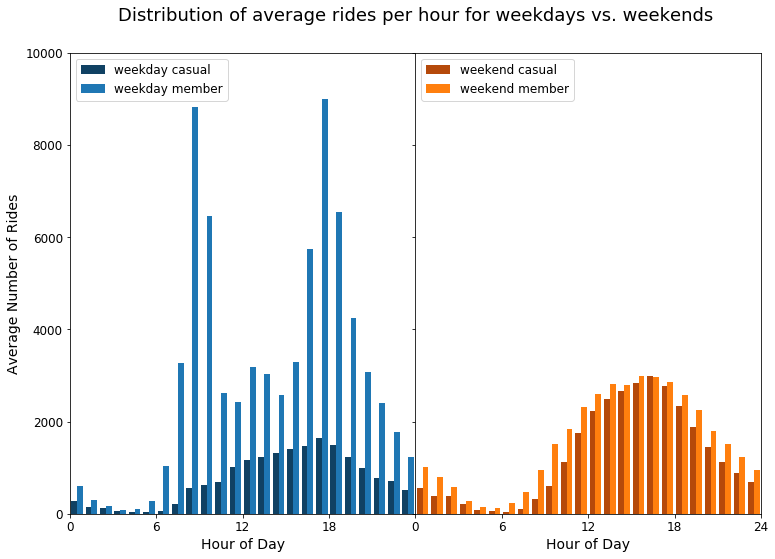

Welcome to OpenDataToronto!  This repo repo houses my analysis of city and
provincial open datasets, many of which were for the [Open Toronto open data
book club meetup](https://www.meetup.com/opentoronto/).  All analysis was done
in Jupyter notebooks, and a list of package requirements can be found in the
README.md under each project's folder.

<h1>27/11/2018 - Toronto Bikeshare Trips July - December 2016</h1> 

[Analysis ipynb](https://nbviewer.jupyter.org/github/cczhu/OpenDataToronto/blob/master/BikeShare/BikeShare%20DashApp%20Data%20Munging.ipynb) 

The Toronto [Q3 and Q4 bikeshare ridedata](https://www.toronto.ca/city-government/data-research-maps/open-data/open-data-catalogue/#343faeaa-c920-57d6-6a75-969181b6cbde)
captures (anonymized) trips taken with the Toronto bikeshare system between July
1st and December 31st, 2016.  The data includes the trip start and end times,
duration, and origin and destination stations.

The visualization is deployed on [Amazon AWS](http://18.191.33.162) using
[Dash](https://plot.ly/products/dash/).  Click on the link below to see more.

 

 

    

 
<i>Plot of the number of rides per hour for the average weekday and weekend,
for the Toronto bikeshare system in Q3-Q4 2016.  Rides are subdivided into
bikeshare members and casual riders (those without a bikeshare app
account).  Weekdays see an increase in the number of member riders during
rush hour, and weekends a general increase in leisure rides.</i>

<h1>20/4/2017 - Toronto City Sidewalk Inventory</h1>

[Analysis ipynb](https://nbviewer.jupyter.org/github/cczhu/OpenDataToronto/blob/master/SidewalkInventory/Toronto%20Sidewalk%20Inventory%20%28Open%20Data%202017-4-20%29.ipynb) 
[Meetup Page](https://www.meetup.com/opentoronto/events/236673636/)

The [Toronto Sidewalk Inventory](https://www.toronto.ca/city-government/data-research-maps/open-data/open-data-catalogue/#3763d352-5f0a-4385-4cec-f255d4860ea5)
is a geospatial dataset that gives the availability of sidewalks along
Toronto's transportation corridors.  I plot a map of these sidewalks, and
investigate the correlation between lack of sidewalks along the roads of a
neighbourhood with its population density and median household income.  I find
that the fraction of underdeveloped or missing sidewalk tends to depend on
population density and on zoning, with densely populated areas and residential
and commercial zones having very little missing sidewalk.  Missing sidewalk,
however, is not correlated with neighbourhood income, so there doesn't appear
to be any favouritism from city hall toward richer neighbourhoods.

    

 
<i>Plot of sidewalk availability for the roadways of Toronto, with the old
Toronto municipality boundaries overplotted for reference.  Colours indicate
roadway type and sidewalk availability.  Red, yellow and green roads indicating
no sidewalks, sidewalk available on one side of the road only, and available on
both sides, respectively, while light and dark blue roads are actually
walkways, pathways or recreational trails.</i>

 

    

 
<i>Sidewalk inventory for roadways of varying types.  Institutional roads
are those bordering universities, schools and hospitals; open roads are
roads within or bordering parks, recreation areas, golf courses, marinas
and cemeteries; and other roads are utility and transportation roads. 
The fraction of sidewalk in a particular state is indicated by the length of
its corresponding bar section.  The meanings of colours are given by the
legend.</i>

 

<h1>23/2/2017 - MyDem0cracy</h1>

[Analysis ipynb](https://nbviewer.jupyter.org/github/cczhu/OpenDataToronto/blob/master/MyDem0cracy/MyDemocracy%20%28Open%20Toronto%202017-2-23%29.ipynb) 
[Meetup Page](https://www.meetup.com/opentoronto/events/236673506/)

The [MyDem0cracy](https://mydem0cracy.ca/) Canadian electoral reform survey 
(note the replacement of "o" by "0") was produced by a group of concerned
citizens as a complementary survey to the [controversial](http://www.cbc.ca/
news/politics/mydemocracy-survey-results-electoral-reform-1.3950671)
[MyDemocracy.ca](https://www.canada.ca/en/campaign/electoral-reform/participate-in-canadian-federal-electoral-reform-consultations/mydemocracyca.html)
survey by the Government of Canada.  The survey solicits freeform comments
from participants, which are then posted to let subsequent participants vote
("agree", "disagree" or "neutral") on the comments.  I investigate the
consensus opinion arising from these comments, and attempt to determine
clusters of voters with similar opinions.  In the aggregate, I find that
participants are all highly in favour of greater political education and civic
engagement.  They disagree, however, with how electoral reform should proceed,
with one large group of users advocating for proportional representation,
another in favour of the current system, and a third without a strong opinion
either way.

    

 
<i>Plot of vote standard deviation vs. vote arithmetic mean of MyDem0cracy
Canadian electoral reform survey comments. Marker sizes represent the total
number of votes a comment received, while colour represents the response
fraction, the percentage of the people who visitied MyDemo0cracy.ca since the
question was posted that voted on the comment.  The dashed grey line
represents the largest standard deviation value for a given mean.
Click <a href="https://cczhu.github.io/OpenDataToronto/images/mydem0cracy_stdevvsmean.html">here</a>
or on the picture to go to the interactive version, where you can hover the
mouse over a marker to read the text of its comment and the number of agree,
disagree and neutral votes for it.</i>

 

<h1>24/11/2016 - Ontario Trillium Fund</h1>

[Analysis ipynb](https://nbviewer.jupyter.org/github/cczhu/OpenDataToronto/blob/master/OTF/Ontario%20Trillium%20Foundation%20Grants%20%28Open%20Data%20Toronto%202016-11-24%29.ipynb) 
[Meetup Page](https://www.meetup.com/opentoronto/events/235293778/)

The [Ontario Trillium Foundation (OTF)](http://www.otf.ca/) is an agency of the
Ontario government that annually allocates more than $136 million dollars in
social/community program funding province-wide.  In accordance with the Ontario
government's Open Data Directive, OTF provides data on successful grant
applications over the last two decades on their [open datapage](http://www.otf.ca/open).
I perform an exploratory analysis on this data, examining how aggregate,
per-capita and per-project funding is divided into different project areas and
geographic regions, and how this changes with time. I find that:

* The total amount of OTF annual funding per capita has gone down by about 20%
over the last two decades.
* The total number of grants has gone down by a factor of 2 since 2011, most
pronounced in the number of arts and sports & recreation grants.  The amount
per grant has gone up by about 50%.
* While geographic regions with larger populations typically get more money in
total, they get around 30% *less* money per capita.  This is likely because
urban areas are wealthier and already have established resources and
institutions, and so need funding less.

    

 
<i>Per-capita OTF Spending in Ontario's census geographic regions.  Brighter
and warmer colours represent higher funding per capita.  Populations are
taken from 2011 census, and annual funding is averaged from its FY 2010 to 2016
values.  Click <a href="https://cczhu.github.io/OpenDataToronto/images/otf_ontario.html">here</a>
or on the picture to go to the interactive version, where you can hover the
mouse over a census area to see its name, population, number of OTF grants
given per year, funding per year, median funding per project, and funding per
capita (all OTF values are also averaged from FY 2010 to 2016).</i>

